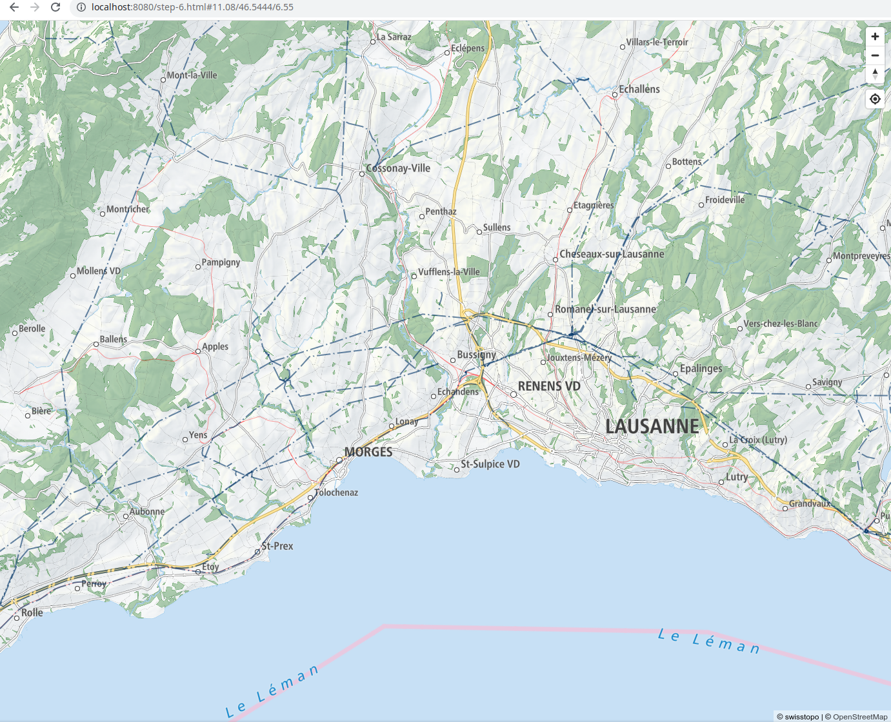

# Tutorial OGC Code Sprint Lausanne

In this tutorial, we want to learn how to make an online map for hot-air ballooning. It should be a basemap showing roads an places, and we want to clearly show forests because they are bad for landing and we want to show electrical power lines, also because they are bad for landing.

We will use vector tiles from Swisstopo and their light base map style. Rendering in the frontend will be with MapLibre GL JS. We will change the default style to highlight forests better. Powerlines will be extracted from OpenStreetMap with Planetiler and we will store them in the PMTiles format.

Since I am bad at coding, we will generate as much code as possible with ChatGPT.

## Demo

https://wipfli.github.io/tutorial-ogc-code-sprint-lausanne/step-6.html

<a href="https://wipfli.github.io/tutorial-ogc-code-sprint-lausanne/step-6.html">

</a>

## Step 1: Requirements

For this tutorial we need the following tools:

1. Text editor
2. Web browser
3. Docker
4. ChatGPT

If you don't have a ChatGPT account, don't worry, you can also just copy-paste the files from this repo here.

```
Stuff in code boxes are ChatGPT prompts
```

## Step 2: Swisstopo Basemap

```
Make a website showing a map with MapLibre GL JS. The map should use the Swisstopo light base map style.json file which is available at `https://google-the-real-url.com/style.json`. Create html code for this.
```

Generated code: [step-2-chatgpt.html](step-2-chatgpt.html)

Fixed code: [step-2.html](step-2.html)

Serve this file with 

```
docker run -it --rm -p 8080:8080 -v $(pwd):/public danjellz/http-server
```
and have a look at it in the web broswer.

## Step 3: Adjust Controls

```
We want to adjust some controls of our map. 
* We would like to show the location of the map in the URL
* There should be zoom in and zoom out buttons
* There should be a way to show the location of the user on the map
```

Generated code: [step-3-chatgpt.html](step-3-chatgpt.html)

Fixed code: [step-3.html](step-3.html)

## Step 4: Make forests more visible

We have now a basemap, but for hot-air ballooning, it is important to know where we can land and we cannot land in forests so it is good to make them a bit more visible.

* Open the swisstopo light base map json file in your web browser
* Create a `style-4.json` file
* Reference the local `style-4.json` file from your JavaScript code
* Search for `forest` and edit the color in the local style file

[step-4.html](step-4.html)

## Step 5: Generate Powerlines Custom Vector Tiles

The basemap also needs to show where powerlines are, because they are dangerous for hot-air balloons. Fortunately, OpenStreetMap has a lot of data on powerlines. We will use [Planetiler](https://github.com/onthegomap/planetiler) to process OSM data and create some vector tiles with powerlines. Planetiler is my favorite tile generation tool for planet-scale data (it is also the only one I know) and it is very fast.

Planetiler can be configured via Java profiles or via YAML files. We use a YAML file like this one:

```yml
schema_name: Power
schema_description: Features that represent electrical power grid
attribution: <a href="https://www.openstreetmap.org/copyright" target="_blank">&copy;
  OpenStreetMap contributors</a>
sources:
  osm:
    type: osm
    url: geofabrik:switzerland
layers:
- id: power
  features:
  - source: osm
    geometry: line
    min_zoom: 7
    include_when:
      power:
      - line
    attributes:
    - key: power
    - key: voltage
    - key: cables
    - key: operator
  - source: osm
    geometry: line
    min_zoom: 10
    include_when:
      power:
      - minor_line
    attributes:
    - key: power
    - key: voltage
    - key: cables
    - key: operator
```

Save this in `data/power.yml`. 

Run Planetiler with:

```
docker run -v "$(pwd)/data":/data ghcr.io/onthegomap/planetiler:latest generate-custom --schema=/data/power.yml --download --output=/data/power.mbtiles
```

Then inspect the tiles with tileserver-gl:

```
docker run --rm -it -v "$(pwd)/data":/data -p 8080:8080 maptiler/tileserver-gl -p 8080
```

## Step 6: Powerline Tiles as Static PMTiles

The MBTiles file is nice but requires a server. Let us use instead the [PMTiles](https://github.com/protomaps/PMTiles) format. You can create PMTiles with Planetiler directly:

```
docker run -v "$(pwd)/data":/data ghcr.io/onthegomap/planetiler:latest generate-custom --schema=/data/power.yml --download --output=/data/power.pmtiles
```

To read from a PMTiles archive, we need to add a plugin to MapLibre GL JS ([see full example](https://github.com/protomaps/PMTiles/blob/main/js/examples/maplibre.html))


```js
<script src="https://unpkg.com/pmtiles@2.7.2/dist/index.js"></script>

let protocol = new pmtiles.Protocol();
maplibregl.addProtocol("pmtiles",protocol.tile);
```

```
* Add a dark blue line layer using the source `power` and the source layer `power`. 
* The line should be wide enough
* The line should be dashed with long and short dashes
* Make the line semi-transparent

Create an example json maplibre style file for this. 
```

[step-6.html](step-6.html)
